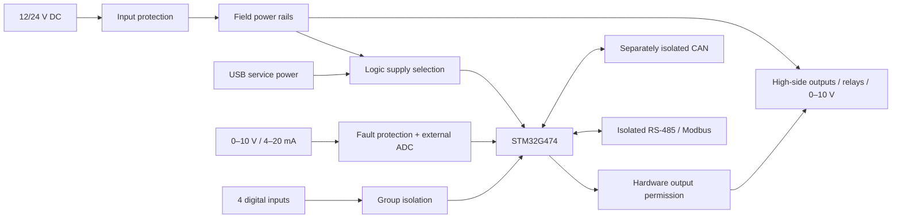

# STM32 Industrial I/O Controller

**Ray Malik · MuffinByteLabs**

[Website](https://muffinbytelabs.com) · [Contact](mailto:muffinbytelabs@gmail.com)

I’m developing a four-layer STM32 controller for industrial sensors and DC actuators. My design brings protected 12/24 V power, precision analog measurement, load diagnostics, and isolated wired communication onto one board.

I’m treating the interfaces as a complete system: power sequencing, field wiring, reset behavior, calibration, and fault recovery are part of the design alongside the signal paths.

**Rev A is in development.** I have defined the architecture, interface requirements, component candidates, and engineering calculations. Schematic capture, PCB layout, application firmware, and prototype measurements are still ahead; the specifications below are my design targets.

## My design at a glance

| Area | Rev A design target |
| --- | --- |
| Controller | STM32G474VET6, integrated directly on the PCB |
| Field power | Nominal 12/24 V DC; 9–30 V continuous operation; reverse-polarity, surge, and current protection |
| Sensor inputs | Four group-isolated digital inputs, one with pulse counting; two 0–10 V inputs; two externally powered 4–20 mA loop receivers |
| Load control | Four diagnosed high-side outputs at 0.5 A each simultaneously; two low-voltage SPDT dry-contact relays |
| Analog control | One protected 0–10 V voltage-source output for loads of at least 10 kΩ |
| Communication | Separately isolated RS-485/Modbus and CAN; USB service and SWD |
| Fault response | Hardware output permission, external watchdog, command timeout, and explicit rearming |
| PCB | Four layers, with dedicated return paths and separate isolation domains |

## System architecture

I organized the design around a protected field supply and a serviceable logic domain. USB supports configuration and debugging without powering field loads.

I describe the power domains, component candidates, and isolation boundaries in my [architecture notes](docs/Architecture.md).

## Engineering decisions

I’m designing for predictable behavior when a wire is disconnected, a rail disappears, or a command stream stops. My [design decisions](docs/Design_Decisions.md) explain the tradeoffs behind analog protection, output backfeed blocking, current diagnostics, and safe startup.

I keep the calculations reproducible. My [power and measurement analysis](docs/calcs/README.md) covers input-current headroom, loop burden, quantization, fault dissipation, and output losses. For example, a 200 Ω loop shunt dissipates 80 mW at 20 mA, but 4.5 W if directly exposed to 30 V; that difference drives my active fault-protection strategy.

I defined a [validation matrix](docs/Validation.md) for calibration, miswiring, short circuits, communication, thermal behavior, and repeatability across three units. I’ll publish measured results with the hardware and firmware revisions that produced them.

## Explore my work

| Document | What I explain |
| --- | --- |
| [Architecture](docs/Architecture.md) | Functional blocks, power domains, isolation, and component selection |
| [Design decisions](docs/Design_Decisions.md) | Circuit tradeoffs, failure modes, and layout rationale |
| [Interfaces](docs/Interfaces.md) | Field connections, electrical limits, and command behavior |
| [Validation](docs/Validation.md) | Acceptance targets, test conditions, and evidence requirements |
| [Hardware](hardware/README.md) | KiCad organization, layer strategy, and library attribution |
| [Firmware](firmware/README.md) | Acquisition, communications, output state management, and calibration |
| [Mechanical integration](mechanical/README.md) | Terminals, mounting, enclosure, and heat |
| [Manufacturing](fabrication/README.md) | Revision control and reproducible fabrication handoff |

I maintain [manufacturer references](references/datasheets/README.md) alongside my calculations. My automated checks verify documentation links, reference identity, and local library paths. Native KiCad checks will run when design files are present.

## License

I publish my original project sources and documentation under [CERN-OHL-P-2.0](LICENSE). I retain the original attribution and terms for manufacturer documents and imported library assets; my [library notes](hardware/libs/README.md) identify that material.
