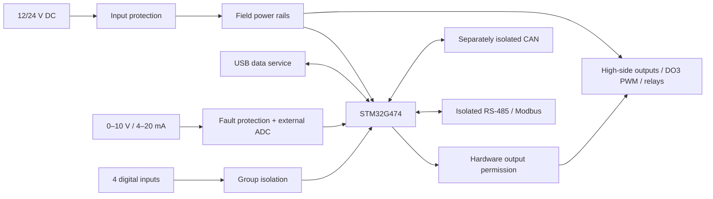

# STM32 Industrial I/O Controller

**Ray Malik · MuffinByteLabs**

[Website](https://muffinbytelabs.com) · [Contact](mailto:muffinbytelabs@gmail.com)

I’m developing a four-layer STM32 controller for industrial sensors and DC actuators. My design brings protected 12/24 V power, precision analog measurement, load diagnostics, and isolated wired communication onto one board.

I’m treating the interfaces as a complete system: power sequencing, field wiring, reset behavior, calibration, and fault recovery are part of the design alongside the signal paths.

**Rev A is in development.** I have defined and reviewed the architecture, interface requirements, exact circuit/support-component selections, MCU resource allocation, and engineering calculations. Schematic capture, PCB layout, application firmware, and prototype measurements are still ahead; the specifications below are my design targets.

My [October 6 independent follow-up](docs/External_Review_Verification.md) corrects the buffer map, main-power allocation, reset selection and regulator package, and records the disposition of the external review. The complete feature set remains; current sourcing, library, capacitor and physical qualification gates are explicit.

I have [frozen the major hardware functions](docs/Scope.md) and am following a [staged implementation plan](docs/Implementation_Plan.md): a useful Modbus controller at nominal 12/24 V and room temperature first, classic CAN next, then bounded PWM and wider qualification including CAN FD. I keep supported functions and measured capabilities separate. My [portfolio evidence guide](docs/Portfolio_Evidence.md) defines the application demonstration and measurements I will publish.

## My design at a glance

| Area | Rev A design target |
| --- | --- |
| Controller | STM32G474VET6, integrated directly on the PCB |
| Field power | Nominal 12/24 V DC; 9–30 V continuous operation; reverse-polarity, surge, and current protection |
| Sensor inputs | Four group-isolated digital inputs, one with pulse counting; two 0–10 V inputs; two externally powered 4–20 mA loop receivers |
| Load control | Four diagnosed high-side outputs at 0.5 A each simultaneously; two low-voltage SPDT relays; DO3 PWM qualification follows static control |
| Communication | Independently isolated RS-485/Modbus and CAN; classic CAN first, CAN FD qualification later; self-powered USB data service and SWD/SWO |
| Fault response | Hardware output permission, external watchdog, command timeout, and explicit rearming |
| PCB | Four layers, with dedicated return paths and separate isolation domains |

## System architecture

I power the complete board from its protected external DC input. USB provides configuration, diagnostics and logging while external power is present. I use DO3 as a static output in the first operating milestone; its later PWM target is 100 Hz and 10–90% commanded duty plus static endpoints with a resistive or compatible LED fixture up to 0.5 A.

I describe the power domains, component candidates, and isolation boundaries in my [architecture notes](docs/Architecture.md).

## Engineering decisions

I’m designing for predictable behavior when a wire is disconnected, a rail disappears, or a command stream stops. My [design decisions](docs/Design_Decisions.md) explain the tradeoffs behind analog protection, output backfeed blocking, current diagnostics, and safe startup.

My [pre-schematic engineering review](docs/Engineering_Review.md) records current component status, corrected current-loop protection, isolated-port power capacity, PWM timing/current diagnostics, and the next design gates. My [capture package](docs/Schematic_Capture.md) links complete power, control, analog and field I/O circuits, with [component selections](docs/components/README.md) and exact support values.

My latest [independent verification](docs/External_Review_Verification.md) records the October 6 corrections and disposition of the external suggestions. The [October 4 review](docs/Pre_Schematic_Review.md) retains its dated findings and open-gate history. I begin with the [library preflight](docs/Library_Preflight.md), creating and comparing each exact-package asset before wiring it.

I have retained the complete architecture in my [architecture review record](docs/Architecture_Review.md). The separate local supplies, analog protection, receiving-domain buffers and hardware shutdown circuits remain in scope. Their capacitor, package, sequence and physical-test requirements still need evidence at the appropriate design stage.

I keep the calculations reproducible. My [power and measurement analysis](docs/calcs/README.md) covers input-current headroom, loop burden, quantization, fault dissipation, output losses, and bounded PWM timing. For example, a 200 Ω loop shunt dissipates 80 mW at 20 mA, but 4.5 W if directly exposed to 30 V; that difference drives my active fault-protection strategy.

I defined a [validation matrix](docs/Validation.md) for calibration, miswiring, short circuits, communication, thermal behavior, and repeatability across three units. I’ll publish measured results with the hardware and firmware revisions that produced them.

## Explore my work

| Document | What I explain |
| --- | --- |
| [Scope](docs/Scope.md) | Retained functions, excluded additions and staged capability claims |
| [Implementation plan](docs/Implementation_Plan.md) | Capture gates, Modbus demonstration, classic CAN, PWM and full qualification |
| [Portfolio evidence](docs/Portfolio_Evidence.md) | One cohesive application, test records and measured results |
| [Protocol contract](firmware/Protocol.md) | Versioned data, guarded commands and communication behavior |
| [Diagnostic tools](tools/diagnostics/README.md) | Host acquisition/logging and explicitly labeled development simulation |
| [Engineering review](docs/Engineering_Review.md) | Manufacturer status, compatibility checks, margins, and review limits |
| [Independent verification](docs/External_Review_Verification.md) | Latest corrections, checked external suggestions and remaining gates |
| [Deep pre-schematic review](docs/Pre_Schematic_Review.md) | October 4 historical findings and open-gate evidence |
| [Schematic capture](docs/Schematic_Capture.md) | MCU resources, rail supervision, sequencing, and circuit checks |
| [Architecture](docs/Architecture.md) | Functional blocks, power domains, isolation, and component selection |
| [Design decisions](docs/Design_Decisions.md) | Circuit tradeoffs, failure modes, and layout rationale |
| [Interfaces](docs/Interfaces.md) | Field connections, electrical limits, and command behavior |
| [Validation](docs/Validation.md) | Acceptance targets, test conditions, and evidence requirements |
| [Hardware](hardware/README.md) | KiCad organization, layer strategy, and library attribution |
| [Firmware](firmware/README.md) | Acquisition, communications, output state management, and calibration |
| [Mechanical integration](mechanical/README.md) | Terminals, mounting, enclosure, and heat |
| [Manufacturing](fabrication/README.md) | Revision control and reproducible fabrication handoff |

I maintain [manufacturer references](references/datasheets/README.md) alongside my calculations. My automated checks verify documentation links, reference identity, and local library paths. Native KiCad checks will run when design files are present.

## License

I publish my original project sources and documentation under [CERN-OHL-P-2.0](LICENSE). I retain the original attribution and terms for manufacturer documents and imported library assets; my [library notes](hardware/libs/README.md) identify that material.
