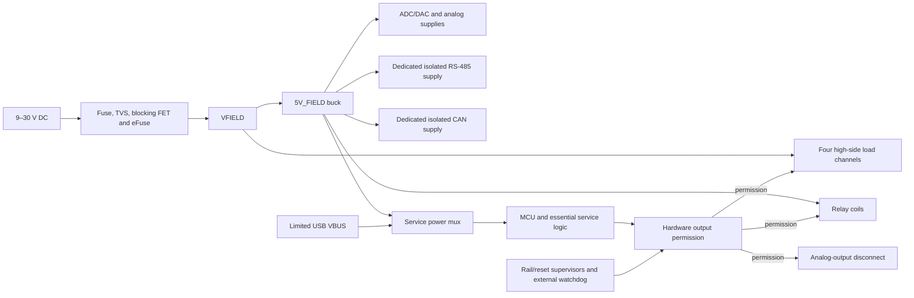

# Architecture

I am developing a four-layer STM32 controller for nominal 12 V and 24 V DC equipment. I want one board to acquire voltage and current-loop signals, count field pulses, switch DC loads, issue a voltage command, and communicate over two independently isolated buses.

I have documented the architecture and specification targets. Schematic capture, PCB layout, firmware implementation, prototype assembly, and measured tests are still pending. I treat the figures below as acceptance targets, not established ratings.

## Functional scope

| Function | Rev A target |
| --- | --- |
| Controller | STM32G474VET6, LQFP100, directly on the PCB |
| Main supply | Nominal 12/24 V DC; 9–30 V continuous operation |
| Digital inputs | Four positive DC inputs sharing an isolated DI_COM; OFF at 0–5 V, ON at 9–30 V |
| Pulse acquisition | DI1 counts 20 kHz, 50% duty-cycle pulses at 12/24 V on a documented cable |
| Voltage acquisition | Two single-ended 0–10 V channels; terminal impedance at least 500 kΩ |
| Current acquisition | Two externally powered 4–20 mA receivers |
| Analog acquisition | 1 kSPS/channel, filtered readings published at 100 Hz |
| Analog output | One sourced 0–10 V command, load at least 10 kΩ, 100 Hz updates |
| Load outputs | Four high-side channels, 0.5 A/channel simultaneously |
| Relay outputs | Two independent SPDT dry-contact circuits; initial target 30 V DC, 1 A resistive |
| RS-485 | Isolated half-duplex Modbus RTU; initial tests at 19,200 and 115,200 bit/s |
| CAN | Separately isolated classic CAN at 500 kbit/s; FD target 500 kbit/s arbitration, 2 Mbit/s data |
| Service | USB-C USB 2.0 full-speed device, keyed 10-pin SWD |
| Environment | Indoor enclosed prototype, 0–50 °C |

I am starting with an approximately 140 × 100 mm board envelope, labeled pluggable terminals, and insulated enclosure mounting. I will set the final outline from the selected enclosure, terminals, isolation spacing, and thermal layout.

## Power architecture

I place the replaceable fuse, bidirectional raw-input TVS, and small raw capacitance before the reverse-blocking FET/eFuse arrangement. I place bulk capacitance after startup control so charging current passes through the inrush limiter. TPS26632 is my starting eFuse choice; its fixed 35 V maximum output clamp and clamp timeout require a coordinated TVS, MOSFET safe-operating-area, fuse, and capacitance design.

| Rail | Planned implementation and loads |
| --- | --- |
| VFIELD | Protected main input; load-switch energy |
| 5V_FIELD | LMR38020 buck; relay coils, field electronics and auxiliary conversion |
| 5V_SYS | TPS2121 selection of field 5 V or limited USB VBUS |
| 3V3_DIG / 3V3_MCU_ANA | TPS62160 / TPS7A20 from 5V_SYS; MCU digital and analog supplies |
| 3V3_FIELD_LOGIC | Separate field-powered regulator; external ADC digital supply and interface buffers |
| ADC_AVDD / DAC supply | Qualified, filtered field 5 V; ADC supply includes a permanent discharge path |
| 15V_ANA / negative bias | TPS55340 boost / LM7705; analog protection and output-amplifier headroom |
| RS-485 / CAN bus supplies | Two separate regulated isolated converters; UCC12050 candidates |

I allocate 2 A to the load channels and 5 W to service electronics within a 3 A continuous input target. At 9 V and 85% assumed conversion efficiency, that is approximately 2.65 A before small field overhead. I will coordinate the approximately 3.5 A nominal electronic limit with tolerances, startup, copper, and connector heating.

I use USB-only power for essential logic and service access. Relay coils, external ADC/DAC, analog auxiliary supplies, isolated bus supplies, and energy outputs remain field-powered. I require powered-off signal isolation at MCU-to-field crossings and protect diagnostic/readback paths against an unpowered MCU. Software validity flags accompany this hardware partition; they do not prevent backpower electrically.

## Ground domains and layout

| Domain | Connections |
| --- | --- |
| MAIN_GND | Main DC negative, MCU, USB ground, AI_RETURN, AO_RETURN and LOAD_RETURN |
| DI_COM | Shared return for all four digital inputs; group isolation from MAIN_GND |
| RS485_REF | RS-485 transceiver bus side, protection and its isolated supply |
| CAN_REF | CAN transceiver bus side, protection and its separate isolated supply |
| Relay contact domains | Each COM/NO/NC circuit separate from its coil and the other relay |
| Chassis/shield | Installation-specific cable/enclosure bond provision |

I keep analog and load returns electrically common while routing actuator current away from ADC references. I preserve a continuous main-ground reference beneath sensitive and fast signals and keep copper clear on every layer across isolation barriers. I will set USB impedance from the actual fabrication stack and check return paths on both routing layers.

I account for USB hosts, oscilloscope grounds, and external sensor supplies when documenting a test connection. Those connections can bond otherwise isolated domains. I will record actual barrier geometry and component limits with the finished layout.

## Acquisition and voltage command

I use two ISO1212 dual receivers for the digital-input group. DI1 goes to a hardware timer with filtering compatible with 25 µs pulse intervals; DI2–DI4 receive configurable debounce for slower signals.

I selected ADS8684A as the four-channel ADC candidate. I plan 0–10.24 V conversion ranges for voltage inputs and 0–5.12 V for current inputs. A 200 Ω Kelvin shunt converts 4–20 mA to 0.8–4 V, contributes 4 V burden and dissipates 80 mW at 20 mA. Protection resistance adds burden. I use externally powered loops and a common analog return; ADC input-ground pins remain near the local ADC reference.

I target ±20 mV voltage error and ±32 µA current error after room-temperature calibration, with ±0.5% of the respective spans over 0–50 °C. I will evaluate loading, drift, settling, noise, calibration uncertainty, and simultaneous load activity against those goals.

I plan two TMUX7462F protector groups: voltage inputs and AO with a starting positive threshold near 11 V, and current inputs near 6 V. Protected source pins face terminals; drain pins face the ADC, shunts, or amplifier path. I select high-impedance drain response during faults and include pulse-limiting impedance and secondary protection. The signal-terminal fault target is ±30 V for 60 s, powered and unpowered, in a defined current-limited setup. Supply sequencing and transient energy remain circuit-design work.

I plan to generate AO with the zero-scale power-on-reset DAC80501Z, a 0–2.5 V range, and OPA197 gain near four. A +15 V rail and small negative bias provide endpoint headroom. My path is DAC → amplifier → separate default-off disconnect → TMUX drain → protected source → terminal. I target ±50 mV terminal error, including zero, full scale, and a 10 kΩ load. A terminal pull-down defines the disabled level for the supported high-impedance wiring case. Protected readback before the disconnect measures the amplifier-side value; I will measure the terminal independently.

## Load control and fault behavior

I selected TPS4H160B-Q1 for four high-side channels with current limiting and sequential, multiplexed current diagnostics. I start the common limit near 0.7 A/channel and plan a latched overload state with explicit recovery. I add a series blocking diode per output and a load-side freewheel diode, anode at LOAD_RETURN and cathode at DOx. I initially qualify on/off loads; their voltage includes semiconductor drops and inductive decay is relatively slow.

I plan to power two G5Q-1 DC5 relay coils through gated drivers with coil suppression. Deenergizing a coil opens COM–NO and closes COM–NC. I will use COM–NO for the demonstration and qualify inductive contact loads separately from the resistive rating.

I require hardware permission equivalent to `FIELD_VALID AND RESET_OK AND WATCHDOG_OK AND ARM` at every high-side command, relay driver, and AO disconnect. AO additionally requires `FIELD_ANALOG_VALID`. Pull-downs establish disabled commands during reset or an unpowered MCU. I plan external reset/supply supervision, a TPS3431 watchdog, and a physical output-inhibit control.

I clear arming on invalid power, reset, watchdog failure, command-owner change, and global faults. I use a default 1 s command timeout and require fresh commands plus explicit rearming after recovery. I keep protocol parsing separate from output control and store versioned calibration/configuration with CRC and recoverable copies.

## Communication and evidence

I use ISO1410 for RS-485 and ISO1042 for CAN, each with its own supply and reference island. I include selectable end termination, reviewed RS-485 bias, and bus-side protection. I will qualify CAN FD on a documented short bus and describe its application messages as a custom protocol. USB provides configuration, calibration, readout, and logs; a single explicit command owner governs outputs across interfaces.

I describe the connection contract in [Interfaces](Interfaces.md), the reasons for these choices in [Design decisions](Design_Decisions.md), and planned evidence in [Validation](Validation.md). My [component references](../references/datasheets/README.md) preserve source PDFs and their revision/package-review limits.
