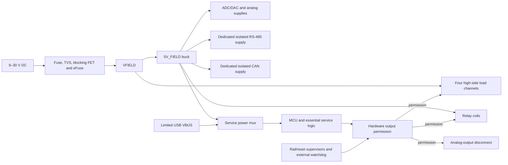

# Architecture

I am developing a four-layer STM32 controller for nominal 12 V and 24 V DC equipment. I want one board to acquire voltage and current-loop signals, count field pulses, switch DC loads, issue a voltage command, and communicate over two independently isolated buses.

I have documented the architecture and specification targets. Schematic capture, PCB layout, firmware implementation, prototype assembly, and measured tests are still pending. I treat the figures below as acceptance targets, not established ratings.

## Functional scope

| Function | Rev A target |
| --- | --- |
| Controller | STM32G474VET6, LQFP100, directly on the PCB |
| Main supply | Nominal 12/24 V DC; 9–30 V continuous operation |
| Digital inputs | Four positive DC inputs sharing an isolated DI_COM; OFF at 0–5 V, ON at 9–30 V |
| Pulse acquisition | DI1 counts 20 kHz, 50% duty-cycle pulses at 12/24 V on a documented cable |
| Voltage acquisition | Two single-ended 0–10 V channels; terminal impedance at least 500 kΩ |
| Current acquisition | Two externally powered 4–20 mA receivers |
| Analog acquisition | 1 kSPS/channel, filtered readings published at 100 Hz |
| Analog output | One sourced 0–10 V command, load at least 10 kΩ, 100 Hz updates |
| Load outputs | Four high-side channels, 0.5 A/channel simultaneously |
| Relay outputs | Two independent SPDT dry-contact circuits; initial target 30 V DC, 1 A resistive |
| RS-485 | Isolated half-duplex Modbus RTU; initial tests at 19,200 and 115,200 bit/s |
| CAN | Separately isolated classic CAN at 500 kbit/s; FD target 500 kbit/s arbitration, 2 Mbit/s data |
| Service | USB-C USB 2.0 full-speed device, keyed 10-pin SWD |
| Environment | Indoor enclosed prototype, 0–50 °C |

I am starting with an approximately 140 × 100 mm board envelope, labeled pluggable terminals, and insulated enclosure mounting. I will set the final outline from the selected enclosure, terminals, isolation spacing, and thermal layout.

## Power architecture

I place the replaceable fuse, bidirectional raw-input TVS, and small raw capacitance before the reverse-blocking FET/eFuse arrangement. I place bulk capacitance after startup control so charging current passes through the inrush limiter. My selected input parts are TPS26632RGER, CSD19537Q3 for the blocking FET, BSS138P,215 for fast gate discharge, and SMCJ33CA for the raw-input TVS. The eFuse has a fixed 35 V maximum output clamp rather than an adjustable overvoltage cutoff. I will coordinate its clamp timeout, startup dissipation, MOSFET safe operating area, capacitance, and fuse interruption rating; these part choices do not establish a surge rating.

I retain 9–30 V as the operating qualification range. Hardware FIELD_OK uses tolerance-bounded trip/release thresholds with guard bands and hysteresis, as defined in my [capture checklist](Schematic_Capture.md); I do not claim an exact 9.000/30.000 V cutoff. Invalid field health clears ARM. I treat −30 V reverse connection separately from surge testing. My initial positive DC-miswire test is a defined 36 V source at 25 °C with controlled voltage tolerance, source current, duration, and TVS temperature; I do not extend that test to cold conditions without reviewing the TVS breakdown shift. I do not claim sustained +40 V survival with SMCJ33CA. For negative pulses, I must also keep the TPS2663 input-to-retained-output differential within its −85 V, 10 ms stress limit: a catalog −53.3 V clamp plus 30 V retained output already reaches −83.3 V before overshoot, and a 35 V retained output would exceed that limit. I will close that coordination against the actual waveform and temperature before qualification.

| Rail | Planned implementation and loads |
| --- | --- |
| VFIELD | Protected main input; load-switch energy |
| 5V_FIELD | LMR38020FDDAR buck, initially forced PWM without spread spectrum; relay coils, field electronics and auxiliary conversion |
| 5V_SYS | TPS2121RUXR selection of field 5 V or separately limited USB VBUS |
| 3V3_DIG / 3V3_MCU_ANA | TPS62160DSGR / TPS70933DBVR from 5V_SYS; MCU digital and analog supplies |
| 3V3_FIELD_LOGIC | TPS70933DBVR from 5V_FIELD; external ADC/DAC digital supplies and field interface buffers |
| ADC_AVDD / DAC supply | Qualified, filtered field 5 V; ADC supply includes a permanent discharge path |
| 15V_ANA / negative bias | TPS61040DBVR light-load boost / LM7705MM/NOPB; analog protection and output-amplifier headroom |
| RS-485 / CAN bus supplies | Two independent UCC33421QDHARQ1 converters, selected for regulated 5 V output; 1.5 W output class with temperature derating |

I allocate 2 A to the load channels and a 6 W delivered service-electronics ceiling at 5V_FIELD, within a 3 A continuous input target. I reserve 5.75 W as follows; these are engineering allocations that combine component limits and conversion assumptions, not a complete guaranteed maximum-power result.

| Service branch, referred to 5V_FIELD | Reservation | Basis |
| --- | --- | --- |
| MCU and essential logic | 0.75 W | 100 mA MCU digital allowance at 3.3 V; logic, supervision, indicators and digital-converter loss reserve |
| External ADC/DAC and field logic | 0.50 W | ADC/DAC supply limits, bleeder, interface logic and filtering reserve |
| +15 V and negative-bias auxiliaries | 0.65 W | 25 mA capacity at 15 V, assumed 60% boost efficiency; approximately 4 mA at 5 V reserved for LM7705 with a dual output amplifier |
| Both relay coils | 1.10 W | Cold coil resistance, its tolerance and an upper 5.25 V supply; 80 mA/coil is nominal only |
| Both isolated bus supplies | 2.75 W | ISO1410 160 mA dynamic limit and ISO1042 73.4 mA DC-dominant limit, with 30 mA combined bias/switching reserve at 5.15 V and assumed 50% isolated conversion efficiency |
| Unallocated margin | 0.25 W | Difference between the reservations and 6 W ceiling |

At 9 V and 85% assumed main-buck efficiency, the input arithmetic is approximately 2.78 A before protection losses and small VFIELD overhead; at 80% it is 2.83 A. I will close the budget at the actual post-protection voltage, with bus switching, startup, supply tolerances, and thermal measurements included. I keep the approximately 3.5 A nominal electronic limit separate from the 3 A continuous target. I select a 5.11 kΩ, 0.1% eFuse-limit resistor and retain the IC limit tolerance separately; the [power specification](circuits/Power.md) defines its bounded source and recovery conditions.

I will keep the complete field 5 V tolerance and transient envelope within the ADC and LM7705 limits, including LM7705's 5.25 V maximum operating input. I do not treat boost disable as rail isolation: TPS61040's inductor/diode path can still feed its output. I keep LM7705 enabled whenever field power is present and require a valid negative bias before permitting AO.

I use USB-only power for essential logic and service access. Relay coils, external ADC/DAC, analog auxiliary supplies, isolated bus supplies, and energy outputs remain field-powered. I require powered-off signal isolation at MCU-to-field crossings and protect diagnostic/readback paths against an unpowered MCU. I will implement the permitted USB-current policy separately from TPS2121's source selection, and measure source-removal reverse current rather than assume ideal instantaneous blocking. Software validity flags accompany this hardware partition; they do not prevent backpower electrically.

## Ground domains and layout

| Domain | Connections |
| --- | --- |
| MAIN_GND | Main DC negative, MCU, USB ground, AI_RETURN, AO_RETURN and LOAD_RETURN |
| DI_COM | Shared return for all four digital inputs; group isolation from MAIN_GND |
| RS485_REF | RS-485 transceiver bus side, protection and its isolated supply |
| CAN_REF | CAN transceiver bus side, protection and its separate isolated supply |
| Relay contact domains | Each COM/NO/NC circuit separate from its coil and the other relay |
| Chassis/shield | Installation-specific cable/enclosure bond provision |

I keep analog and load returns electrically common while routing actuator current away from ADC references. I preserve a continuous main-ground reference beneath sensitive and fast signals and keep copper clear on every layer across isolation barriers. I will set USB impedance from the actual fabrication stack and check return paths on both routing layers.

I account for USB hosts, oscilloscope grounds, and external sensor supplies when documenting a test connection. Those connections can bond otherwise isolated domains. I will record actual barrier geometry and component limits with the finished layout.

## Acquisition and voltage command

I use two ISO1212 dual receivers for the digital-input group. DI1 goes to a hardware timer with filtering compatible with 25 µs high and low intervals; DI2–DI4 receive configurable debounce for slower signals.

I selected ADS8684AIDBTR as the four-channel ADC. I plan 0–10.24 V conversion ranges for voltage inputs and 0–5.12 V for current inputs. A 200 Ω Kelvin shunt converts 4–20 mA to 0.8–4 V, dissipating 80 mW at 20 mA. Each current terminal passes through a TPS26611DDFR before the permanent shunt; its maximum 12.5 Ω resistance adds up to 0.25 V at 20 mA, giving a 4.25 V receiver burden before wiring. I specify at least a 1 W precision shunt to cover the protector's 40 mA upper current-limit bound, then separately check pulse energy and thermal derating. I use externally powered loops and a common analog return; ADC input-ground pins remain near the local ADC reference.

I target ±20 mV voltage error and ±32 µA current error after room-temperature calibration, with ±0.5% of the respective spans over 0–50 °C. I include the ADC's biased input loading, sensor source impedance, protection resistance, drift, settling, noise, calibration uncertainty, and simultaneous load activity. The current receiver's qualification goal extends to 24 mA; the ADC's arithmetic 25.6 mA endpoint is not a guaranteed usable overrange.

I plan two TMUX7462F sense-protector groups: voltage inputs and AO terminal readback with a starting positive threshold near 11 V, and current-shunt sense branches near 6 V. Source pins face field-exposed nodes and drains face the ADC or attenuated readback circuits. The TMUX is not in the current-loop path ahead of the shunt: otherwise an open switch can let loop compliance voltage hold it faulted. I select high-impedance drain response during faults and include pulse-limiting impedance and secondary protection. The signal-terminal fault target is ±30 V for 60 s, powered and unpowered, in a defined current-limited setup. Supply sequencing, transient energy, and TPS26611 recovery remain capture and qualification gates.

I generate AO with the zero-scale POR DAC80501ZDGSR and OPA2197IDR dual amplifier: the first stage has a local gain-four divider, and the second is a unity driver. The ADG5401FBCPZ-RL7 main channel connects the driver to AO1; its separate protected feedback channel senses AO1 directly at the unity driver's inverting input. This places reviewed series resistance inside terminal feedback without adding feedback-switch resistance to the gain divider. On disable or a powered fault, ADG5401F closes its internal driver-to-feedback connection while opening both field paths. I use +15 V/GND for the switch and +15 V/LM7705 negative bias for the amplifiers.

I hold AO enable low through rail qualification, DAC initialization and settling, and explicit arming. I use grounded POC for the switch's weak disabled pulldown plus a permanent 100 kΩ terminal pulldown. I target ±50 mV terminal error into an external load of at least 10 kΩ, including zero and full scale. I require independently protected and attenuated terminal readback, with receiving-domain powered-off isolation before the MCU ADC. Readback and switch feedback are different circuits: the internal feedback node does not prove terminal voltage while disabled. Compensation, cable capacitance, rail-loss behavior, endpoint accuracy, and clamp values remain schematic checks. I record the supporting review in [Engineering review](Engineering_Review.md).

## Load control and fault behavior

I selected TPS4H160BQPWPRQ1 for four high-side channels with current limiting and sequential, multiplexed current diagnostics. I start the common limit near 0.7 A/channel, with a 2.87 kΩ, 1% current-limit resistor as the initial calculation. Its tolerance is too large for a precision trip threshold. I hold THER high for latched thermal shutdown, remove channel commands on overload, and require explicit recovery. Thermal-swing protection can act before that latch, so I will verify the complete fault sequence rather than promise a single uninterrupted fault pulse.

I start with STPS2H100A for each series blocking diode and load-side freewheel diode, with the latter's anode at LOAD_RETURN and cathode at DOx. These are 100 V, 2 A candidates that still need load-energy and layout qualification. The manufacturer's conduction-loss model gives about 0.29 W per blocking diode at 0.5 A; I include roughly 1.17 W for all four in thermal planning and do not treat this model as a guaranteed maximum. The high-side switch's four-channel conduction is about 0.17 W using its 25 °C maximum resistance, or 0.28 W using its 150 °C maximum, before operating-current loss. I initially qualify on/off loads; their voltage includes semiconductor drops and inductive decay is relatively slow. Diode leakage and the modified open-load path require measured backfeed and diagnostic criteria.

I select a 1.21 kΩ burden with a 124 kΩ bleeder in parallel, giving 1198.3068 Ω and about 2 V raw sense voltage at 0.5 A with a nominal 300:1 ratio. My [analog specification](circuits/Analog.md) fixes the clamped buffer, attenuation, receiving-domain isolation and calibrated diagnostic transfer. Sense-ratio tolerance, selector settling and fault-report states remain part of prototype qualification. Simultaneous channel overloads can also trip the global eFuse; I will specify recovery for that case rather than promise that other channels always remain powered.

I plan to power two G5Q-1 DC5 relay coils through gated drivers with coil suppression. I reserve about 210 mA combined for cold coils at the upper rail voltage and will qualify pickup, dropout, and release timing with the actual suppression network. Deenergizing a coil opens COM–NO and closes COM–NC. I will use COM–NO for the demonstration and qualify inductive contact loads separately from the 30 V DC, 1 A resistive target.

I use one hardware `PERMISSION` net for all four high-side commands, both relay drivers and AO disconnect. It requires `ANALOG_VALID AND RESET_OK AND WATCHDOG_OK AND DISARM_N AND ARM_STATE`. ANALOG_VALID combines field input, ADC 5 V, +15 V, negative bias, reference and field logic health. A missing required analog rail therefore also disarms DO and relay outputs. The [control circuit](circuits/Control_Service.md) fixes every gate and default. Pull-downs establish disabled commands during reset or an unpowered MCU. I select TPS3808G33DBVR reset supervision, a TPS3431 watchdog, SN74LVC2G08DCUR permission gates, and an SN74LVC1G74DCUR ARM latch with asynchronous clearing. Reset, watchdog failure, field invalidity, and physical inhibit clear the latch; a stale high command GPIO cannot rearm it after power returns. My [capture checklist](Schematic_Capture.md) defines the rail monitors and receiving-domain buffers.

I clear arming on invalid power, reset, watchdog failure, command-owner change, and global faults. I use a default 1 s command timeout and require fresh commands plus explicit rearming after recovery. I keep protocol parsing separate from output control and store versioned calibration/configuration with CRC and recoverable copies.

## Communication and evidence

I use ISO1410 for RS-485 and ISO1042 for CAN, each with its own supply and reference island. I include selectable end termination, reviewed RS-485 bias, and bus-side protection. I will qualify CAN FD on a documented short bus and describe its application messages as a custom protocol. USB provides configuration, calibration, readout, and logs; a single explicit command owner governs outputs across interfaces.

I describe the connection contract in [Interfaces](Interfaces.md), the reasons for these choices in [Design decisions](Design_Decisions.md), and planned evidence in [Validation](Validation.md). My [component references](../references/datasheets/README.md) preserve source PDFs and their revision/package-review limits.

I fix regulator support values, exact connectors and complete control/analog networks in my [capture package](Schematic_Capture.md). I use its circuit specifications for detailed implementation values.
