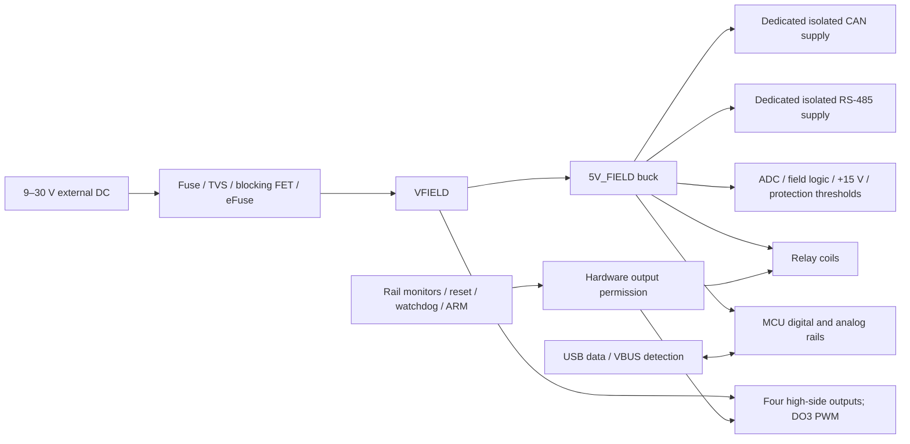

# Architecture

I am developing a four-layer STM32 controller for nominal 12/24 V DC equipment. I use it to acquire industrial sensor signals, count pulses, operate small DC loads, and exchange commands and measurements over independently isolated wired buses.

Rev A is a pre-schematic design. My circuit selections and calculations define implementation targets; schematic connectivity, PCB layout, firmware and measured ratings remain pending.

## Functional scope

| Function | Rev A target |
| --- | --- |
| Controller | STM32G474VET6, LQFP100, directly on the PCB |
| Supply | External nominal 12/24 V DC; 9–30 V continuous qualification range |
| Digital inputs | Four positive DC inputs sharing isolated DI_COM; OFF at 0–5 V, ON at 9–30 V |
| Pulse acquisition | DI1: 20 kHz, 50% duty-cycle target with a documented 12/24 V source and cable |
| Voltage acquisition | Two single-ended 0–10 V inputs; terminal impedance target ≥500 kΩ |
| Current acquisition | Two externally powered 4–20 mA receivers; 200 Ω permanent Kelvin shunts |
| Sampling | External 16-bit ADC, 1 kSPS/channel; 100 Hz filtered publication |
| Load outputs | Four monitored high-side channels, 0.5 A/channel simultaneously |
| PWM | DO3: timer-generated 100 Hz, 10–90% commanded duty plus 0/100% endpoints; initial resistive or compatible LED load ≤0.5 A |
| Relays | Two independent SPDT dry contacts; initial 30 V DC, 1 A resistive qualification target |
| RS-485 | Independently isolated Modbus RTU; initial 19,200/115,200 bit/s fixtures |
| CAN | Independently isolated classic CAN at 500 kbit/s, then FD at 500 kbit/s arbitration / 2 Mbit/s data |
| Service | Self-powered USB-C full-speed data device, keyed SWD/SWO, recoverable EEPROM settings |
| Fault behavior | Rail supervision, external watchdog, hardware permission, command timeout and fresh rearming |
| Environment | Indoor enclosed prototype, 0–50 °C |

I start with a provisional 140 × 100 mm envelope. I will set its final size from the enclosure, terminals, isolation spacing and thermal layout.

## Power architecture

The external supply powers the complete board. USB VBUS supplies only its detection/protection interface; it does not feed board regulators. I preserve powered-off signal protection because separately derived rails can still rise and decay at different rates. USB communication requires valid external power and detected VBUS.

| Rail | Implementation and purpose |
| --- | --- |
| VFIELD | Protected main input and load-switch energy |
| 5V_FIELD | LMR38020FDDAR buck; all downstream conversion, relay coils and isolated supplies |
| 3V3_DIG / 3V3_MCU_ANA | TPS62160DSGR digital buck / TPS70933DBVR MCU analog LDO |
| 3V3_FIELD_LOGIC | Separate TPS70933DBVR field-interface LDO |
| ADC_AVDD | Filtered field 5 V with permanent discharge path |
| 15V_ANA | TPS61040DBVR boost for the retained analog input protectors and threshold supplies |
| VFP11 / VFP6 | TPS7A16 threshold rails for voltage/current sense protection |
| Isolated port rails | Two separate UCC33421QDHARQ1 supplies and reference islands |

I retain the positive auxiliary and threshold rails because the input-protection circuits need them. The [power specification](circuits/Power.md) fixes support values, enables and shutdown behavior; boost disable alone does not isolate its passive output path.

I reserve 6 W delivered at 5V_FIELD. The following allocations are conservative engineering reservations, rather than predictions or guaranteed device maxima.

| Branch referred to 5V_FIELD | Reservation |
| --- | --- |
| MCU and essential logic | 0.75 W |
| External ADC and field logic | 0.50 W |
| Positive analog auxiliary conversion | 0.65 W |
| Both relay coils, including cold resistance allowance | 1.10 W |
| Both isolated bus supplies, including conversion assumptions | 2.75 W |
| Unallocated margin | 0.25 W |

I retain a 3 A continuous main-input target and budget all four load channels at continuous 0.5 A, including DO3 at 100% duty. At 9 V and assumed 85% main-buck efficiency, 2 A of loads plus 6 W of service gives about 2.784 A before protection losses and overhead. At 80% it gives 2.833 A. PWM switching heat needs separate thermal analysis; lower duty does not reduce my continuous qualification fixture. Four pre-diode 10 kΩ bleeders add at most 12 mA nominal at 30 V. I separately reserve 20 mA for high-side operating current as an engineering allowance, giving approximately 2.808 A at 9 V/85% before protection losses; it is not a guaranteed maximum.

For 9 V operation under combined load, I require VFIELD ≥8.4 V after protection, limiting the complete fuse/FET/eFuse/terminal/trace drop to 0.6 V. At 8.4 V and assumed 80% buck efficiency, four 0.5 A loads, nominal bleeders and the 20 mA operating allowance total about 2.916 A. I close the remaining margin with hot/tolerance and measured values. FIELD_OK uses a 190 kΩ/10 kΩ UV network with nominal 8.0 V release; its cornered release stays below 8.4 V.

My input parts are TPS26632RGER, CSD19537Q3, BSS138P,215 and provisional SMCJ33CA. I coordinate fuse interruption, eFuse clamp timeout, startup capacitance, FET safe operating area and TVS temperature against the actual fixture. The initial +36 V fault test is bounded at 25 °C; reverse connection begins at −30 V with discharged rails. Catalog TVS clamping and retained output charge require separate negative-pulse coordination. I do not infer a surge rating from individual part ratings.

## Signal paths and isolation

| Domain | Connections |
| --- | --- |
| MAIN_GND | DC negative, MCU, USB, AI_RETURN and LOAD_RETURN |
| DI_COM | Four digital inputs isolated together from MAIN_GND |
| RS485_REF | Dedicated bus-side supply, transceiver and protection |
| CAN_REF | Independently supplied CAN bus-side circuit |
| Relay contacts | Each COM/NO/NC group independent of its coil and the other relay |
| Chassis/shield | Installation-specific enclosure/cable bond |

Analog inputs share the main reference. I route actuator return currents away from the ADC reference and maintain a continuous main-ground plane under sensitive and fast signals. Every isolation barrier has copper keepouts on all layers. USB hosts, grounded probes or external supplies can bridge domains; I record their actual connections during tests.

I use two ISO1212 receivers for four digital inputs. DI1 reaches a timer counter with filtering compatible with its 25 µs high/low target; the other inputs use configurable debounce.

ADS8684A acquires two voltage channels and two current channels. TPS26611 remains ahead of each permanent current shunt, while TMUX7462F protects only high-impedance sensing branches. At 20 mA, the shunt dissipates 80 mW and the receiver burden is up to 4.25 V before wiring. My calibrated targets are ±20 mV / ±32 µA at room temperature and ±50 mV / ±80 µA over 0–50 °C. Loading, drift, settling, calibration uncertainty and simultaneous switching remain in the error budget. The [analog specification](circuits/Analog.md) defines the complete path.

## Load control and communication

TPS4H160B supplies four current-limited high-side outputs. DO1, DO2 and DO4 provide on/off control. DO3 uses PE9 / TIM1_CH1 / AF2 for PWM, through the same hardware permission gate. Each internal switch-output node also has a 10 kΩ bleeder to define its off state before the blocking diode. Series blocking diodes limit positive backfeed; separate freewheel diodes provide a reviewed decay path for bounded on/off inductive loads.

PWM is an added low-frequency load-control mode. A compatible load sees full supply pulses, not a precision analog command. The first fixture is resistive or a compatible LED assembly; I qualify edge timing, minimum pulse width, switching loss and current-sense timing before extending the operating envelope. Motor control and proportional-solenoid operation require a separate load/energy review.

Current diagnostics are sequential. PWM readings represent settled on-state driver current, including the small bleeder current, and carry timing/validity information; an average-current estimate requires a stated load model. Hardware limiting and permission removal do not depend on successful sampling. Two G5Q-1 DC5 relays provide dry SPDT contacts; deenergized COM–NO is open and COM–NC closed.

ISO1410 and ISO1042 each have an independent isolated supply, reference and protection island. I qualify Modbus RTU and classic CAN first, then the short-bus CAN FD target. I select one command owner—Modbus, CAN or local demonstration—with a default 1 s command lease. Owner changes, rail loss, reset, watchdog failure and reported high-side/global faults clear arming. Firmware must disable timer commands before recovery and issue fresh valid commands and an explicit arm transition.

My [interface contract](Interfaces.md), [capture package](Schematic_Capture.md), [design decisions](Design_Decisions.md) and [validation matrix](Validation.md) describe the implementation and required evidence.
